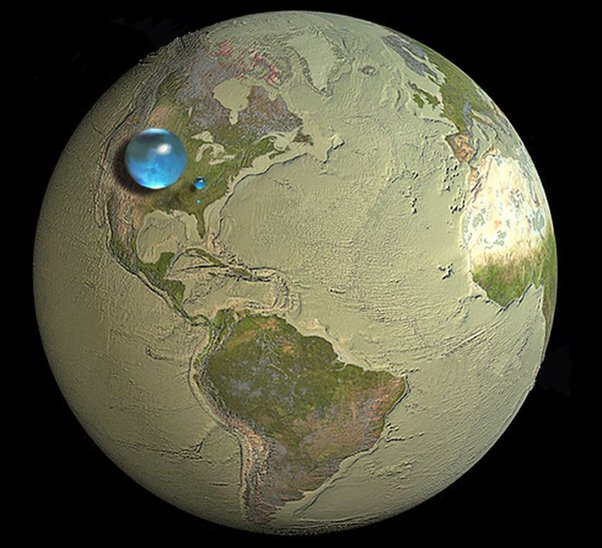

---

title: L'analogie que proposait Paul-Emile Victor en 1975, par rapport à l'eau disponible sur Terre est-elle correcte ? (Si la Terre = une orange alors toute l'eau représenterait 1 toute petite goutte, composée elle même de 99% d'eau salée)
slug: l-analogie-que-proposait-paul-emile-victor-en-1975-par-rapport-a-l-eau-disponible-sur-terre-est-elle-correcte-si-la-terre-une-orange-alors-toute-l-eau-representerait-1-toute-petite-goutte-composee-elle-meme-de-99-d-eau-salee
date: '2019-12-21'
draft: true
categories:
- Quora
tags: []
coverImage: ./images/qimg-db3a2ff547af160f175495acfbc2b6af.jpg
---

*Réponse publiée [sur Quora](https://fr.quora.com/L-analogie-que-proposait-Paul-Emile-Victor-en-1975-par-rapport-%C3%A0-l-eau-disponible-sur-Terre-est-elle-correcte-Si-la-Terre-une-orange-alors-toute-l-eau-repr%C3%A9senterait-1-toute-petite-goutte/answer/Dr-Goulu)*

Oui. L'eau salée fait une grosse goutte, l'eau douce gelée dans les glaces polaires une toute petite à côté, et l'eau douce liquide la minuscule goutte en dessous :

