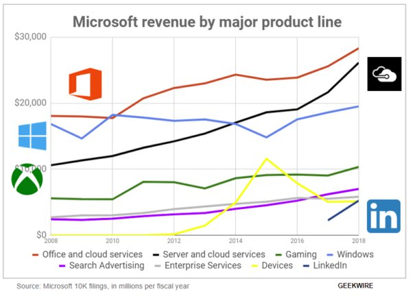

*Article initialement publié sur [Quora](https://fr.quora.com/Lancien-PDG-de-Microsoft-Steve-Ballmer-sest-il-jamais-excus%C3%A9-pour-avoir-d%C3%A9clar%C3%A9-Linux-est-un-cancer/answer/Dr-Goulu)*

Pourquoi l'aurait-il fait ? Dans le contexte de Microsoft c'est tout à fait exact.

D'ailleurs ils l'ont choppé : [Microsoft will ship a full Linux kernel in Windows 10](https://www.theverge.com/2019/5/6/18534687/microsoft-windows-10-linux-kernel-feature).

Si vous regardez leurs revenus par ligne de produit vous voyez que Windows péclote depuis des années…

Remarquez aussi que Ballmer a dit ça en 2001 quand Windows était le principal produit MS (avec Office …) et qu'ils ont finalement assez bien réagi au cancer en développant d'autres produits.
