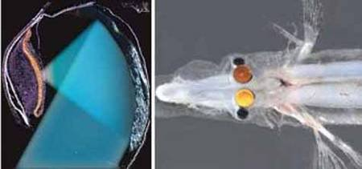

*Réponse publiée [sur Quora](https://fr.quora.com/Le-principe-de-fonctionnement-dune-Oeil-humain-est-il-diff%C3%A9rent-de-celui-dun-chien-ou-dun-chat/answer/Dr-Goulu)*

Non, extrêmement similaire.

Il y a un article très intéressant de l' [Hôpital vétérinaire de Rawdon inc.](https://web.archive.org/web/20190829/https://www.facebook.com/hopvetrawdon/posts/341313016052189/) sur facebook qui explique bien les différences. Le contenu facebook n'était pas libre, je ne le copie pas ici.

A part les yeux à facettes des insectes, l'oeil très différent des autres animaux est celui de [Dolichopteryx longipes](w:), un poisson des profondeurs. Il utilise le principe du télescope à l'aide d'écailles - miroir !

Mais je vous rassure : c'est oeil est le résultat de l'évolution, comme les autres.

[Quand Darwin invente le télescope - Pourquoi Comment Combien](/2009/02/26/dolichopteryx-longipes/)
