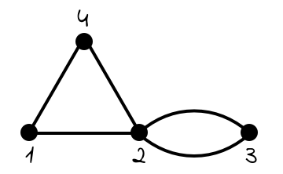

*Réponse publiée [sur Quora](https://fr.quora.com/Le-probl%C3%A8me-math%C3%A9matique-dans-Will-Hunting-%C3%A9tait-il-si-difficile/answer/Dr-Goulu)*

J'avais oublié le problème, mais en fait il y en a deux, décrits avec solution dans [The Math Problems from Good Will Hunting, w/ solutions](https://web.archive.org/web/20190930172020/https://medium.com/cantors-paradise/the-math-problems-from-good-will-hunting-w-solutions-b081895bf379)

**Le premier problème** concerne ce graphe:

et les questions sont :

1. donner la [Matrice d'adjacence](w:) de ce graphe.
2. donner la matrice donnant le nombre de chemins de longueur 3 entre les noeuds i,j
3. donner la fonction génératrice des chemins de i à j
4. donner la fonction génératrice de 1 à 3

La question 1 est vraiment facile si on sait ce qu'est la matrice d'adjacence d'un graphe . La 2 et la 3 sont un peu plus dures (= je n'y arriverais plus aujourd'hui sans aide…), mais sans problème pour un étudiant en maths niveau universitaire. La 4 est une application numérique de la 3.

**Le second problème**, que le professeur dit avoir mis deux ans à résoudre est:

1. combien y'a-t-il d'arbres avec n noeuds numérotés ?
2. tracer tous les arbres homomorphiquement irréductibes pour n=10

En fait le problème concerne la [Formule de Cayley](w:), connue depuis 1860. La difficulté (relative) est de la démontrer, mais ce n'est pas demandé. En réfléchissant un peu pour de petits n, on arrive assez facilement à la retrouver. Ensuite, tracer toutes les formes d'arbres différents est un petit casse-tête…

En ce qui me concerne je trouve ce second problème plus simple que le premier, je pense que je m'en serais sorti aussi bien que Will …

Donc non, ces problèmes ne sont pas très difficiles.
