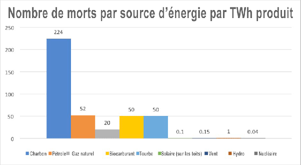

*Article initialement publié sur [Quora](https://fr.quora.com/Ma%C3%AEtrise-t-on-%C3%A0-100-les-dangers-du-nucl%C3%A9aire/answer/Dr-Goulu)*

On ne maitrise à 100% aucun danger. On peut juste les comparer aux bénéfices, ou à d’autres dangers.

Une comparaison possible est le nombre de morts par terawattheure d’énergie produit :

Source: [Le nucléaire est le moyen le moins dangereux de produire de l’électricité](https://www.dreuz.info/2019/03/04/le-nucleaire-est-le-moyen-le-moins-dangereux-de-produire-de-lelectricite/)

Source de la source: Markandya, A., & Wilkinson, P. (2007). Electricity generation and health. Lancet Vol. 370, Issue 9591, pp 979-990 DOI:[10.1016/S0140-6736(07)61253-7](https://web.archive.org/web/20180624180221/https://doi.org/10.1016/S0140-6736(07)61253-7)

(graphique changé et source ajoutée après le commentaire de [Pierre C](https://fr.quora.com/profile/Pierre-C-17) )
