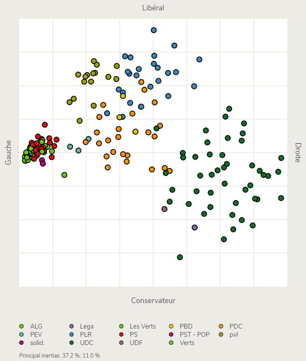
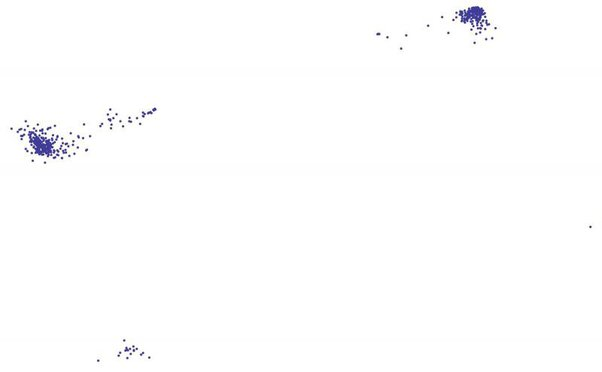

*Réponse publiée [sur Quora](https://fr.quora.com/O%C3%B9-vous-situez-vous-sur-le-Political-Compass-Pouvez-vous-partager-votre-r%C3%A9sultat-au-questionnaire/answer/Dr-Goulu)*

Mon score à ce test américain (centre du carré vert gauche/libertarien) importe peu, mais ces représentations politiques à deux dimensions sont très intéressantes. Le problème du [Quadrant politique](w:)de Political Compass ou du [Diagramme de Nolan](w:), c'est qu'ils se basent sur des axes définis a priori. On peut aussi se demander si un deuxième axe a vraiment du sens, encore plus dans un système bipartite …

D'autres méthodes comme le [smartvote](https://web.archive.org/web/20191125/https://www.smartvote.ch/fr/group/2/election/19_ch_nr/smartmap?locale=fr_CH) suisse utilisent des méthodes mathématiques comme l'[Analyse en composantes principales](w:) pour déterminer automatiquement les deux axes, et même pour démontrer qu le troisième n'est pas significatif. Avec ces méthodes, les dénominations "libéral/conservateur" et même "gauche/droite" sont posées a posteriori, pas a priori.

Voici par exemple la carte du positionnement des 200 parlementaires fraîchement élus à notre [Conseil National](w:Conseil_national_(Suisse)) :

A l'occasion de la présidentielle française, je m'étais demandé dans [La politique française dans la 2ème dimension ? - Pourquoi Comment Combien](/2017/05/14/la-politique-francaise-dans-la-deuxieme-dimension/) si le deuxième axe n'était pas devenu principal…

Suite à cet article, une petite collaboration s'est engagée pour appliquer la méthode à l'Assemblée Nationale en utilisant la base de données des votes nominatifs qui était disponible sous Hollande ( [Votes - Opendata - Assemblée nationale](http://data.assemblee-nationale.fr/travaux-parlementaires/votes) Je m'aperçois à l'instant que ces données sont toujours disponibles pour la nouvelle législature)

Le code pour les exploiter est ici, si ça intéresse : [goulu/smartvoteFR](https://github.com/goulu/smartvoteFR)

Et la première (moche) carte produite pour la France est-celle-ci :

En raison de la manière dont les question sont posées à l'Assemblée Nationale, l'axe gauche/droite est inversé. le FN est en bas (conservateur), mais pas si à droite que ça …
