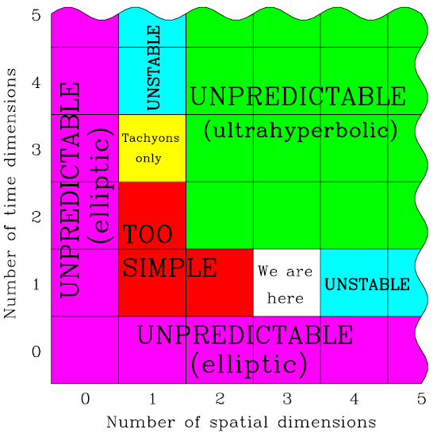

---

title: Peut-on évoluer comme si de rien n'était à l’intérieur de la sphère de Schwarzschild d'un trou noir supermassif, par exemple dans un système solaire orbitant très rapidement, ou est-on condamné à tomber inexorablement au centre ?
slug: peut-on-evoluer-comme-si-de-rien-n-etait-a-linterieur-de-la-sphere-de-schwarzschild-d-un-trou-noir-supermassif-par-exemple-dans-un-systeme-solaire-orbitant-tres-rapidement-ou-est-on-condamne-a-tomber-inexorablement-au-centre
date: '2019-12-07'
draft: true
categories:
- Quora
tags: []
coverImage: ./images/qimg-d316477e77f2fd3a91b5e00c35f4b159.png
---

*Réponse publiée [sur Quora](https://fr.quora.com/Peut-on-%C3%A9voluer-comme-si-de-rien-n-%C3%A9tait-%C3%A0-l-int%C3%A9rieur-de-la-sph%C3%A8re-de-Schwarzschild-d-un-trou-noir-supermassif-par-exemple-dans-un-syst%C3%A8me-solaire-orbitant-tr%C3%A8s-rapidement-ou-est-on/answer/Dr-Goulu)*

C’est plus compliqué que ça.

Selon [Aurélien Barrau](w:) (mais je crois que ça vient des travaux [Jean-Pierre Luminet](w:), sauf erreur…)

> A l'intérieur d'un trou noir, le temps se change en espace et l'espace se change en temps. On pourrait le dire de façon métaphorique : dans notre monde, le temps s'écoule. 'Je ne peux pas revenir dans le passé'. De la même manière, dans un trou noir, c'est l'espace qui s'écoule. Le tapis roulant de l'espace va tellement vite que même si je cours à la vitesse de la lumière dans le sens inverse, je ne pourrai jamais m'extraire du trou noir.[[1]](#tvGUg)

Selon le [Principe holographique](w:) (faible), la question n’a tout simplement pas de sens car il n’y a rien à l’intérieur de l’horizon des événements. Mais vraiment rien, au point que le concept même d’ “intérieur de l’horizon des événements” n’a pas de sens, l’horizon étant une frontière de notre Univers… Pour s’initier à cette idée perturbante, je conseille de lire “[https://fqxi.org/data/essay-cont...](https://fqxi.org/data/essay-contest-files/Mkel_FQxiessay.pdf)” résumé en français ici : [Selon Newton, l'univers serait digital - Pourquoi Comment Combien](/2011/08/13/selon-newton-lunivers-serait-digital/)

De plus, les vrais trous noirs tournent à une vitesse de malade, ce qui enroule l'espace autour d'eux. A l'intérieur de l'horizon, s'il existe, c'est le temps qui est enroulé..

J'y pense maintenant : il y a un article[[2]](#hPyzW) très intéressant de [Max Tegmark](w:) qui explique [Pourquoi notre univers a 3 dimensions + 1 temps](/2011/01/30/pourquoi-3-dimensions-1-temps/), ou plutôt que si ça n'était pas le cas, nous n'existerions pas. Et dans son graphique :

on voit qu'un univers à une dimension spatiale et 3 dimensions temporelles est justement celui dans lequel les [Tachyons](w:Tachyon) peuvent exister.

En l'absence de mécanisme de conversion de matière "normale" en tachyons à l'horizon des événements, je penche encore plus pour l'hypothèse holographique : l'intérieur de l'horizon des événements n'existe tout simplement pas.

Notes de bas de page

[[1]](#cite-tvGUg)[L'article à lire pour comprendre les trous noirs](https://www.francetvinfo.fr/sciences/espace/l-article-a-lire-pour-comprendre-les-trous-noirs_835713.html)

[[2]](#cite-hPyzW)[https://arxiv.org/PS_cache/gr-qc...](https://arxiv.org/PS_cache/gr-qc/pdf/9702/9702052v2.pdf)
