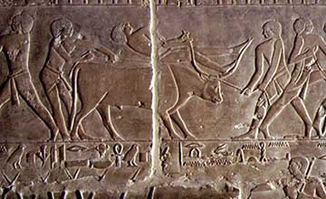

*Article initialement publié sur [Quora](https://fr.quora.com/Pourquoi-aucun-scientifique-na-t-il-pu-proposer-la-th%C3%A9orie-de-la-s%C3%A9lection-naturelle-avant-Darwin/answer/Dr-Goulu)*

Comme toutes les grandes idées, il faut du temps pour que les esprits y soient réceptifs. Aristote avait déjà mentionné cette idée mais pour la réfuter :

> Les dents, par exemple, naîtraient les unes, les incisives, tranchantes et propres à couper les aliments, les autres, les molaires, larges et aptes à les broyer ; car dit-on, elles ne seraient pas produites en vue de ces fonctions, mais par accident elles s’en trouveraient capables. De même pour toutes les autres parties qui sont, selon l’opinion générale, en vue de quelque chose. Les êtres chez lesquels il s’est trouvé que toutes les parties sont telles que si elles avaient été produites en vue de quelque chose, ceux-là ont survécu étant, par un effet du hasard, convenablement constitués ; ceux, au contraire, pour qui il n’en a pas été ainsi, ont péri et périssent [...]. Mais il est impossible que dans la réalité il en soit ainsi ( Aristote *Physique II, La nature, chapitre VIII* p.81 dans l'édition électronique dirigée par Laurence Hansens-Love *Profil Textes philosophiques*, édition 1990)

Ensuite la sélection artificielle par les éleveurs est devenue une évidence. Il suffit de comparer une vache actuelle à celles gravées par les égyptiens[[1]](#SUNvg)

(bon ok ça a plutôt l'air d'un taureau, mais regardez sa taille…)

Juste avant Darwin, le pasteur [Joseph Townsend](w:) décrivit la sélection naturelle de chèvres et de chiens abandonnés sur une île. Il semblerait que ceci ait inspiré Darwin.

Et quasi simultanément avec Darwin, [Alfred Russel Wallace](w:) avait aussi proposé une sélection naturelle, mais en accordant moins d'importance que Darwin à la sélection sexuelle au sein d'une espèce, et plus que lui aux contraintes de l'environnement (prédateurs, nourriture etc.)

Avant le 19ème siècle, le monde n'était pas prêt pour cette idée. D'ailleurs 150 ans plus tard, il y en a toujours qui la refusent …

Notes de bas de page

[[1]](#cite-SUNvg)[https://www.osirisnet.net/docu/v...](https://web.archive.org/web/20200705080735/https://www.osirisnet.net/docu/veaux/veaux.htm)
