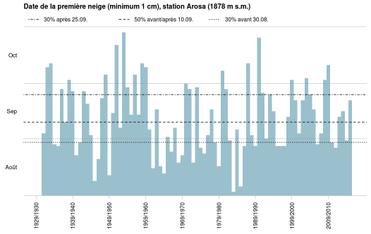

*Réponse publiée [sur Quora](https://fr.quora.com/Pourquoi-la-neige-en-montagne-est-elle-tomb%C3%A9e-d%C3%A9but-novembre-cette-ann%C3%A9e-Cela-garantie-t-il-lenneigement-pour-la-saison-de-ski/answer/Dr-Goulu)*

Rien d'exceptionnel selon [Première neige - MétéoSuisse](https://www.meteosuisse.admin.ch/home/climat/climat-de-la-suisse/informations-saisonnieres/premiere-neige.html) :

> Depuis le début des mesures digitalisées jusqu'en 1931, il y a de grandes différences selon les années pour la date de la première neige mesurable. En raison du réchauffement climatique, la date de la première neige devrait être de plus en plus tardive. Or, avec les données originales à disposition, cette tendance ne se dégage pas.

Voici par exemple le graphique pour la station de ski d'Arosa, où on voit que Novembre, c'est tellement tard que ce n'est pas sur le graphique (il a surement neigé avant, mais je n'ai pas réussi à trouver quand)

Sur [Historique des chutes de neige sur Verbier](https://web.archive.org/web/20170817013129/https://fr.skiinfo.ch/valais/verbier/historique-enneigement.html?y=0) vous pouvez voir que les chutes de neige sont extrêmement variables d'une année sur l'autre, et n'ont pas l'air d'être liées à la date de la première neige.

Mon expérience est que [trois jours de foehn](w:Effet_de_foehn) suffisent à réduire n'importe quelle couche de neige à presque rien, la température étant parfois si élevée que les canons à neige ne peuvent pas fonctionner. Pour bien skier, il faut surtout qu'il n'y ait pas eu de foehn depuis la dernière chute de neige.

Le ski est un sport qui se pratique dans la nature. Rien n'est garanti.
