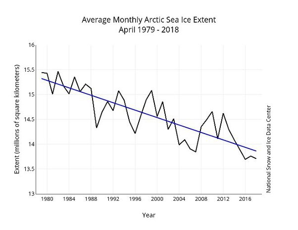

*Réponse publiée [sur Quora](https://fr.quora.com/Pourquoi-la-surface-de-la-banquise-arctique-varie-t-elle-autant-d-une-ann%C3%A9e-sur-l-autre/answer/Dr-Goulu)*

[État de la banquise](https://web.archive.org/web/20190913134558/http://www.meteofrance.fr/actualites/62058614-etat-de-la-banquise) sur météo France décrit plusieurs phénomènes, notamment l'emport de glaces par les courants.

Cela dit, ces "grandes" variations commencent à devenir petites face à la tendance globale

