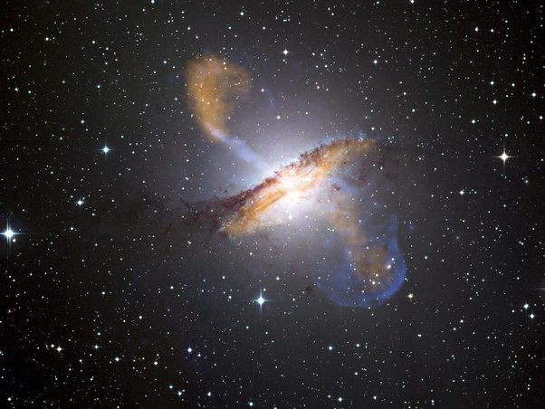

---

title: Qu'est-ce qui est expulsé dans l'espace par le trou noir géant (200 millions de masses solaires) au cœur de la galaxie active Centaurus A, à 13 millions d'années lumière de la Terre, au point qu'on le surnomme trou noir fumant ?
slug: qu-est-ce-qui-est-expulse-dans-l-espace-par-le-trou-noir-geant-200-millions-de-masses-solaires-au-cur-de-la-galaxie-active-centaurus-a-a-13-millions-d-annees-lumiere-de-la-terre-au-point-qu-on-le-surnomme-trou-noir-fumant
date: '2019-12-10'
draft: false
categories:
- Quora
tags:
- physique
- astronomie
- astrophysique
- espace
- trous-noirs
coverImage: ./images/qimg-c2e166d7e14b1968a76a19185f09e528.jpg
---

*Réponse publiée [sur Quora](https://fr.quora.com/Quest-ce-qui-est-expuls%C3%A9-dans-lespace-par-le-trou-noir-g%C3%A9ant-200-millions-de-masses-solaires-au-c%C5%93ur-de-la-galaxie-active-Centaurus-A-%C3%A0-13-millions-dann%C3%A9es-lumi%C3%A8re-de-la-Terre-au-point/answer/Dr-Goulu)*

La [Composition des jets](w:Jet_(astrophysique)) émis par l'environnement des trous noirs est encore sujette à discussion. Tout le monde est d'accord qu'ils contiennent des électrons et de positons, mais la question de savoir si des protons et autres noyaux sont émis par le même phénomène ou "juste" entrainés par le flux d'électrons/positons est encore ouverte.

Image composite de [NGC 5128](w:en:Centaurus_A) / Centaurus A dans le visible, le radio (en orange) et le X (bleu). On distingue bien le jet "bleu" en direction du coin haut/gauche, l'onde de choc de celui du bas avec le gaz interstellaire, et les zones de gaz chauffé en orange.
