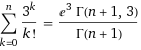
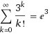

*Article initialement publié sur [Quora](https://fr.quora.com/Que-vaut-%CE%A3-1n-3-k-k/answer/Dr-Goulu)*

[Wolfram|Alpha](https://web.archive.org/web/20190515/https://www.wolframalpha.com/input/?i=sum+3^k/k) dit que:

pour n tendant vers l'infini :

mais tout ça c'est en commençant par k=0, donc pour k=1 il faut enlever 3^0/0! qui vaut 1.
