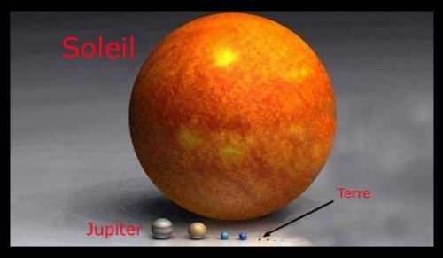
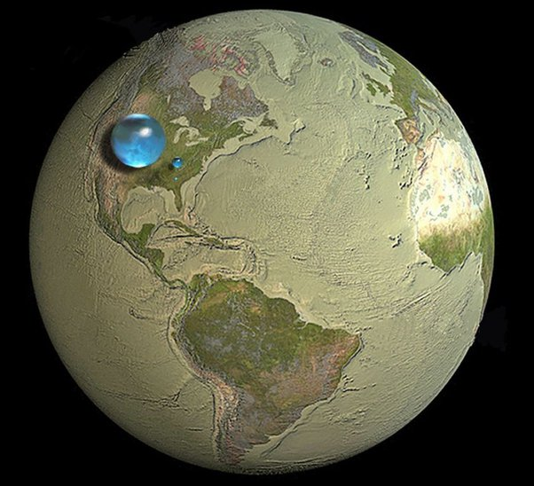

*Article initialement publié sur [Quora](https://fr.quora.com/Si-1-000-milliards-de-seaux-deau-%C3%A9taient-d%C3%A9vers%C3%A9s-simultan%C3%A9ment-sur-le-Soleil-que-se-passerait-il/answer/Dr-Goulu)*

Juste pour comprendre de quoi on parle :

(la grande bille bleue est l’eau des océans, la petite l’eau douce et la toute petite en dessous de la petite, l’eau douce de surface (lacs et rivières)[[1]](#tgIcV)

Regardez bien les images et vous aurez la réponse à votre question : rien.

Notes de bas de page

[[1]](#cite-tgIcV)[Combien d’eau y a-t-il sur Terre ?](https://web.archive.org/web/20190419174215/http://passeurdesciences.blog.lemonde.fr/2012/05/20/combien-y-a-t-il-d-eau-sur-terre/)
