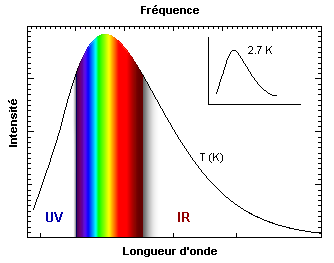

---

title: Si on en croit la théorie de l'évolution de Darwin, l'oeil humain est-il appelé à évoluer pour étendre sa vision dans tout le spectre lumineux ou sommes nous condamnés à ne voir que dans la partie visible du spectre lumineux ?
slug: si-on-en-croit-la-theorie-de-l-evolution-de-darwin-l-oeil-humain-est-il-appele-a-evoluer-pour-etendre-sa-vision-dans-tout-le-spectre-lumineux-ou-sommes-nous-condamnes-a-ne-voir-que-dans-la-partie-visible-du-spectre-lumineux
date: '2019-08-19'
draft: true
categories:
- Quora
tags: []
coverImage: ./images/qimg-c739884c641b5b0fd94019f69820f726.gif
---

*Réponse publiée [sur Quora](https://fr.quora.com/Si-on-en-croit-la-th%C3%A9orie-de-l-%C3%A9volution-de-Darwin-l-oeil-humain-est-il-appel%C3%A9-%C3%A0-%C3%A9voluer-pour-%C3%A9tendre-sa-vision-dans-tout-le-spectre-lumineux-ou-sommes-nous-condamn%C3%A9s-%C3%A0-ne-voir-que/answer/Dr-Goulu)*

S'il n'y a pas d'avantage évolutif (de survie ou reproductif) à "voir" dans un spectre plus large, il n'y a pas sélection naturelle allant dans ce sens.

Les oiseaux, insectes, araignées et certains poissons sont [Tétrachromates](w:Tétrachromatisme), ils ont des cônes percevant les UV

Il est suspecté que quelques pourcent des humains, surtout des femmes pourraient être tétrachromates, mais pas dans les UV (voir [Tétrachromatisme éventuel des humains](w:Tétrachromatisme)). Il est possible que "nous" ayons plutôt perdu cette faculté inutile pour nous puisque nos yeux (trichromates) sont déjà adaptés au maximum du spectre dans lequel le Soleil émet :

Donc par définition nous voyons toute la partie visible du spectre électromagnétique. La lumière visible n'a rien de spécial par rapport au reste du spectre sinon que nous avons des organes qui ont évolué pour la percevoir.
