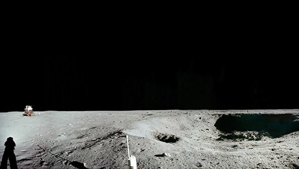
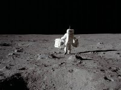
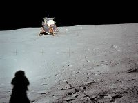

*Réponse publiée [sur Quora](https://fr.quora.com/Sur-les-images-de-Neil-Armstrong-marchant-sur-la-Lune-pourquoi-ne-voit-on-pas-de-crat%C3%A8res-alors-que-la-surface-Lunaire-en-est-couverte/answer/Dr-Goulu)*

Je me demande quelles photos vous avez vu parce que presque toutes celles qu'on peut trouver sur [Apollo 11 Image Gallery](https://web.archive.org/web/20190919022425/https://www.nasa.gov/apollo11-gallery) montrent des cratères.

