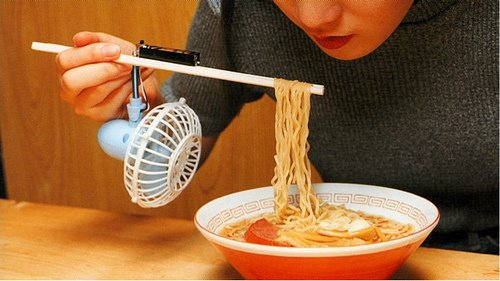
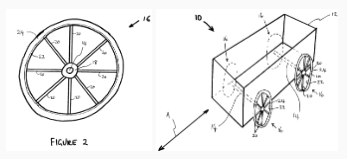

*Article initialement publié sur [Quora](https://fr.quora.com/Une-demande-de-brevet-a-t-elle-d%C3%A9j%C3%A0-%C3%A9t%C3%A9-refus%C3%A9e-parce-quelle-%C3%A9tait-trop-stupide/answer/Dr-Goulu)*

Pour être [Brevetable](w:Brevet), une invention doit être:

1. nouvelle, c'est-à-dire que rien d'identique n'a jamais été accessible à la connaissance du public, par quelque moyen que ce soit (écrit, oral, utilisation…), où que ce soit, quand que ce soit. Elle ne doit pas non plus correspondre au contenu d'un brevet qui aurait été déposé mais non encore publié ;
2. L'invention doit impliquer une activité inventive, c'est-à-dire qu'elle **ne peut pas découler de manière évidente** de l'[état de la technique](w:État_de_l'art), pour un homme du métier ;
3. L'invention doit être susceptible d'une application industrielle, c'est-à-dire qu'elle peut être utilisée ou fabriquée dans tout genre d'industrie.

Donc si vous définissez “stupide” par “évidente”, alors oui, un brevet devrait en principe être refusé. Mais si c’est l’invention qui vous parait stupide, comme ce chindogu[[1]](#zHotx) par exemple, ça se discute …

Mais pour des raisons expliquées dans [[2]](#hDtvC) , la tendance est plutôt d’accorder facilement les brevets et de laisser les avocats régler les conflits.

Exemple de brevet accordé facilement : le brevet australien 2001100012 de 2001 à John Keogh un pour un “appareil circulaire facilitant le transport” (“circular transportation facilitation device”) [[3]](#pCEfp) dont voici les deux figures illustrant l’invention :

Mais dans ce cas c’est plutôt le critère de nouveauté qui pourrait être contesté. En fait, le brevet a été annulé après le tollé de rire généré

Notes de bas de page

[[1]](#cite-zHotx)[Initiation au Chindogu - Pourquoi Comment Combien](/2009/12/24/initiation-au-chindogu/)

[[2]](#cite-hDtvC)[Combien pour ce brevet ? - Pourquoi Comment Combien](/2009/03/08/combien-pour-ce-brevet/)

[[3]](#cite-pCEfp)[https://www.tuv.com/media/german...](https://web.archive.org/web/20190710010617/https://www.tuv.com/media/germany/50_trainingandconsulting/pdf/patente/Circular_transportation_facilitation_device.pdf)
