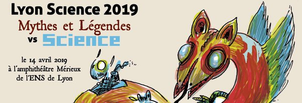

*Réponse publiée [sur Quora](https://cafedessciences.quora.com/Venez-à-Lyon-Science-2019-dimanche-14-avril)*

Dimanche 14 avril, le [Café des Sciences](https://www.cafe-sciences.org/) et ses partenaires ont le plaisir de vous inviter à leur l’événement [Lyon Science 2019](https://web.archive.org/web/20190412032824/http://www.lyon-science.fr/category/lyon-science-2019/) consacré cette année aux liens entre Mythes, Légendes et Science. Comme chaque année, une brochette de scientifiques et de vulgarisateurs vous ont concocté de courtes présentations amusantes sur ce thème. Il y aura aussi de stables rondes et des stands avec animations pour petits et grands. Et l’entrée est libre !

Venez nombreux ! (J’y serai.)
