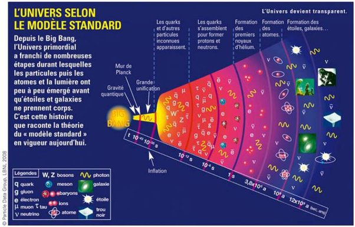

*Réponse publiée [sur Quora](https://fr.quora.com/Comment-comprendre-do%C3%B9-vient-lorigine-de-londe-lumineuse-et-corpusculaire-avant-le-big-bang/answer/Dr-Goulu)*

Je ne sais pas de quoi vous parlez.

Le [Big Bang](w:) correspond à un état de l'Univers extraordinairement dense et chaud.

Il était si dense et chaud qu'il n'y avait pas de "lumière" : les photons avaient une telle énergie qu'il n'étaient pas dans le spectre visible mais dans les [Rayon gamma](w:)+++ et interagissaient entre eux[[1]](#AIztd) en ayant aucun espace pour se propager. L'Univers était opaque pendant ses 380'000 premières années. Ce que nous observons de plus ancien avec nos télescopes est le [Fond diffus cosmologique](w:) qui date de cette époque, et nous ne pourrons pas observer de lumière datant d'avant.

Quand aux "corpuscules", j'imagine que vous voulez dire "particules", on ne sait pas s'il y en avait. Selon le [Modèle standard de la physique des particules](w:), il n'y en avait pas. Les quarks et électrons sont apparus après le premier milliardième de milliardième de milliardième de seconde, peut-être par les interactions "photons-photons".

Il n'y a donc pas d' "onde" datant du Big Bang.

Quand à "avant le Big Bang", rien ne dit qu'il y avait un "avant" (cf les autres questions/réponses à ce sujet)

Notes de bas de page

[[1]](#cite-AIztd)[Two-photon physics - Wikipedia](w:en:Two-photon_physics)
