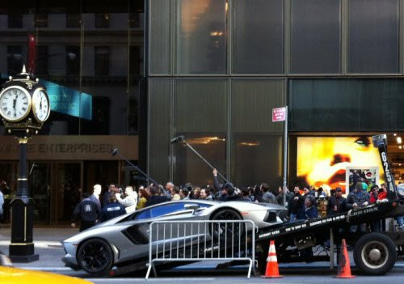

*Réponse publiée [sur Quora](https://fr.quora.com/Quel-petit-d%C3%A9tail-dun-film-de-DC-aimes-tu/answer/Dr-Goulu)*

Moi.

Je me baladais à New-York en octobre 2011 quand j'ai vu ça de l'autre côté de la rue :

En demandant à un passant ce qui se passait, j'ai appris que c'était le tournage du Batman "The Dark Knight Rises". Et effectivement la "Trump Tower" avait été rebaptisée "Wayne Enterprises" …

En regardant le film en HD, pendant un travelling en image par image, et en sachant où j'étais de l'autre côté de la rue, on voit trois pixels qui correspondent à ma tronche…

Fierté, célébrité …
