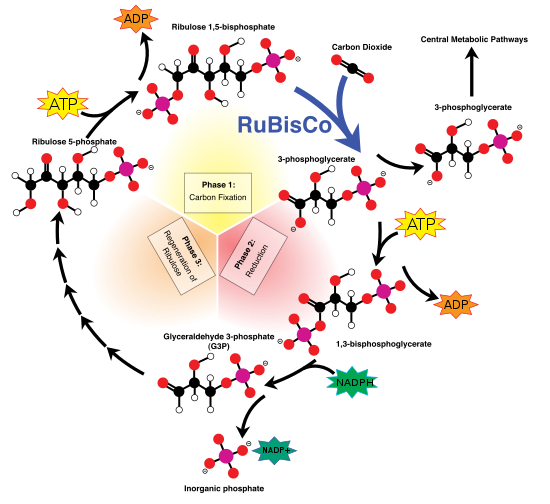

*Réponse publiée [sur Quora](https://fr.quora.com/Comment-les-forces-%C3%A9lectromagn%C3%A9tiques-des-atomes-qui-sexcercent-dans-chaque-cellule-de-lorganisme-sont-parfaitement-equilibrees/answer/Dr-Goulu)*

Les [liaisons chimiques](w:Liaison_chimique) ne sont pas vraiment électromagnétiques, plutôt [électrostatiques](w:Électrostatique).

La plus simple, la [Liaison ionique](w:), est purement [électrostatique](w:), mais la [liaison de van der Waals](w:Force_de_van_der_Waals) qui lie les [molécules polaires](w:Polarité_(chimie)) donne lieu à un [potentiel interatomique](w:) bien plus complexe. L'eau en est l'exemple le plus simple, mais beaucoup de molécules organiques sont polaires et interagissent par des liaisons de van der Waals ou des [Liaisons π](w:Liaison_π).

D'autre part, si les forces qui s'exercent sur un atome sont parfaitement équilibrées, il ne bouge pas. Les forces interatomiques dans un caillou sont beaucoup mieux équilibrées que dans n'importe laquelle de vos cellules.

Car la vie se caractérise justement par la présence de réactions chimiques permanentes qui n'arrêtent pas de casser des liaisons, d'en recréer d'autres dans un déséquilibre permanent.

Par exemple, Le [Cycle de Calvin](w:) que les plantes utilisent pour synthétiser leur propre matière à partir du CO2 de l'air et de l'énergie que la [Photosynthèse](w:) fournit sous forme d'[Adénosine triphosphate](w:) ressemble à ça:

Et ça c'est en résumé, parce que si vous parcourez l'article [Cycle de Calvin — Wikipédia](w:Cycle_de_Calvin) vous verrez le détail de chaque réaction…

Ce cycle se produit des milliards de fois par seconde dans chaque petite cellule végétale, traitant une misérable molécule de CO2 à la fois pour produire les molécules que de très nombreux autres cycles de ce genre utiliseront dans des milliards de cellules pour produire un séquoia millénaire si tout va bien, ou du tofu pour végétariens au pire.

Si tout à coup ces mécanismes manquent de CO2, d'eau, de lumière ou d'autres molécules nécessaires aux déséquilibres qui les font grandir, se reproduire, bref vivre, ben là les forces sur les atomes s'équilibrent : ils meurent et deviennent poussière, fossile, ou crotte.
