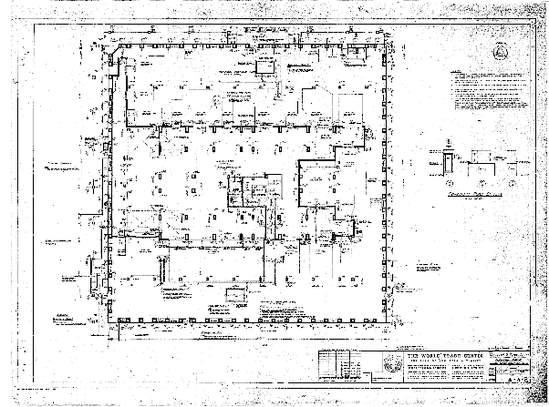

*Réponse publiée [sur Quora](https://fr.quora.com/Pourquoi-le-11-septembre-2001-les-tours-du-World-Trade-Center-se-sont-effondr%C3%A9es-sur-elles-m%C3%AAme-comme-pour-une-d%C3%A9molition-contr%C3%B4l%C3%A9e/answer/Dr-Goulu)*

parce que ces bâtiments étaient principalement tenus par leurs façades :

les planchers des étages étaient accrochés aux façades. Lorsque l'incendie les a chauffés au dessus des points d'impact des avions, ils se sont effondrés les uns sur les autres et leur poids était alors trop élevé pour les points d'attache. Les étages sont tombés à l'intérieur du bâtiment en tirant les étages vers l'intérieur.

Les flashs lumineux qu'on voit sur certaines videos en dessous du niveau d'effondrement sont produits par l'énergie cinétique des étages tombant sur un étage encore fixe.

[Effondrement des tours du World Trade Center — Wikipédia](w:Effondrement_des_tours_du_World_Trade_Center)
