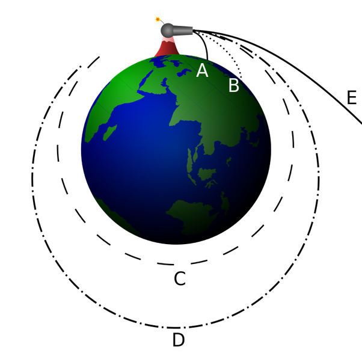

*Réponse publiée [sur Quora](https://fr.quora.com/Quelle-force-fait-que-la-Terre-tourne-%C3%A0-1100km-h-autour-du-soleil/answer/Dr-Goulu)*

Aucune force n'est nécessaire pour qu'un corps reste en orbite autour d'un autre. C'est un cas particulier de chute libre, comme l'avait compris [Newton avec son canon](w:Canon_de_Newton):

La vitesse initiale (110'000 km/h, pas 1100…) de la Terre est à quelque chose près la même que celle du [Disque protoplanétaire](w:) qui l'a formée à cette distance du Soleil.

L'[Inertie](w:), ou "première loi du mouvement" du décidément génial Newton fait qu'un corps qui a une certaine vitesse la garde s'il n'y a pas d'autre force en jeu et continue tout droit.

La relativité d'Einstein explique que l'espace est déformé par les masses, et que la Terre va tout droit dans cet espace déformé par le Soleil. C'est pour ça qu'elle tourne autour. Sans aucune force.
