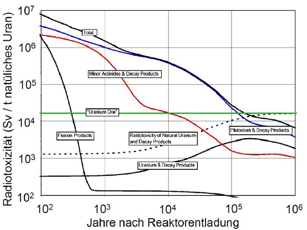

*Réponse publiée [sur Quora](https://fr.quora.com/Combien-dann%C3%A9es-faut-il-pour-que-les-d%C3%A9chets-nucl%C3%A9aires-deviennent-sans-danger/answer/Dr-Goulu)*

Ca dépend du type de déchets et de ce qu'on appelle "sans danger".

La définition la plus courante est "moins radioactif que le minerai d'uranium", la ligne verte dans le diagramme ci-dessous (attention à l'échelle log/log) :

Donc les "produits de fission", qui sont les plus radioactifs puisqu'ils ont des demi vies courtes, passent en dessous de la ligne en quelques siècles,

Pour les "actinides mineurs", comptez 10'000 ans

Seuls les [Déchets de haute activité et à vie longue](w:Déchet_de_haute_activité_et_à_vie_longue) (notamment le plutonium apprécié des militaires, ligne bleue) doivent rester plusieurs centaines de milliers d'années sous terre. C'est peut-être beaucoup pour vous, mais pour un géologue ce n'est rien du tout.

[Bure, plongée dans l'éternité - Pourquoi Comment Combien](/2014/05/24/bure-pour-leternite/)

Ce que j'ai trouvé intéressant dans ces graphiques, ce sont les bosses.

Elles sont causées par les "& decay products" : en se désintégrant, certains isotopes produisent des isotopes à plus petite demie vie qu'eux, donc plus radioactifs qui font augmenter la radioactivité.

Par exemple l'Uranium pur est peu radioactif, mais le radium et le radon qu'il produit le sont beaucoup. Donc la ligne verte du minerai d'uranium est en réalité celle de l'uranium qui monte d'un facteur 10 à cause du radium et du radon (en pointillé).
