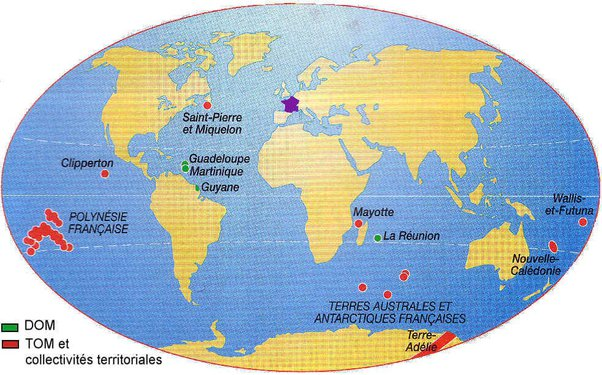

*Réponse publiée [sur Quora](https://fr.quora.com/Pourquoi-n-y-a-t-il-pas-de-port-spatial-en-France-ailleurs-qu-en-Guyane/answer/Dr-Goulu)*

parce que la Guyane est le DOM/TOM le plus proche de l'équateur:

Et si vous voulez savoir pourquoi les bases spatiales ont intérêt à être le plus proche possible de l'équateur, cherchez sur Quora : la question a déjà été posée de multiples fois.
