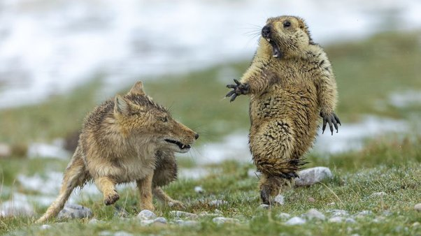

*Réponse publiée [sur Quora](https://fr.quora.com/Est-ce-que-la-communication-inter-esp%C3%A8ce-est-possible-quand-l-humain-n-est-pas-impliqu%C3%A9/answer/Dr-Goulu)*

Très clair cette communication, non ?

Cette photo du chinois Youngqing Bao a gagné le prix ["Wildlife photographer of the year 2019"](https://www.nhm.ac.uk/visit/wpy.html)
