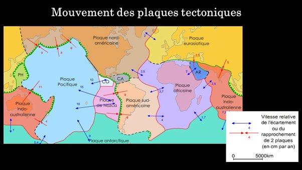

*Réponse publiée [sur Quora](https://fr.quora.com/Comment-le-mouvement-des-plaques-tectoniques-affecte-t-il-les-GPS-et-l-utilisation-de-Google-Maps-par-exemple/answer/Dr-Goulu)*

C'est trop lent pour avoir une importance réelle (quelques cm par an, cf carte ci-dessous) et en plus les continents sont "en un seul morceau" donc pas de risque qu'une route fasse subitement un angle…

J'imagine que ce sera assez facile de décaler toutes les positions d'un continent de quelques mètres dans une base de données le jour où ça posera un problème …
