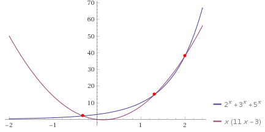
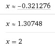

*Réponse publiée [sur Quora](https://fr.quora.com/Comment-trouvez-vous-les-solutions-%C3%A0-cette-%C3%A9quation-2-x-3-x-5-x-11x-2-3x/answer/Dr-Goulu)*

En faisant 2 courbes comme [Wolfram|Alpha](https://www.wolframalpha.com/input/?i=solve+2^x+3^x+5^x=11x^2−3x+) :

puis en utilisant des méthodes numériques qui donnent les intersections (comme Wolfram Alpha…):

