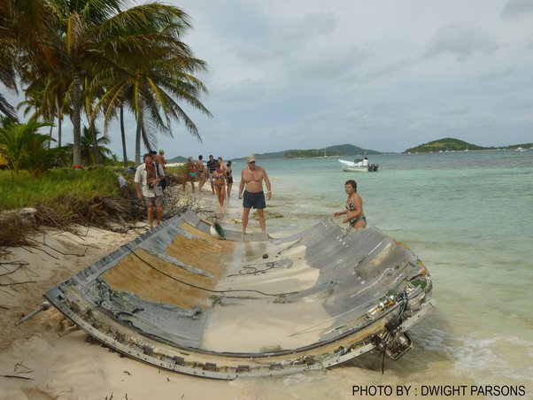

*Réponse publiée [sur Quora](https://fr.quora.com/Est-ce-que-cest-possible-de-polluer-lespace/answer/Dr-Goulu)*

Par définition, la [Pollution](w:)

> est la dégradation d'un [écosystème](w:) ou de la [biosphère](w:) par l'introduction, généralement humaine, d'entités (physiques, chimiques ou biologiques), ou de radiations altérant le fonctionnement de cet écosystème.
>
>
>
> (Wikipédia)

L'espace n'étant pas un écosystème, ni une biosphère, j'aurais tendance à dire non.

Avec une réserve pour les choses qu'on "introduit" là haut et qui nous retombent sur la tronche …

Genre ce morceau de fusée russe retombé aux [Tobago Cays](w:), un endroit mââââgnifique.

