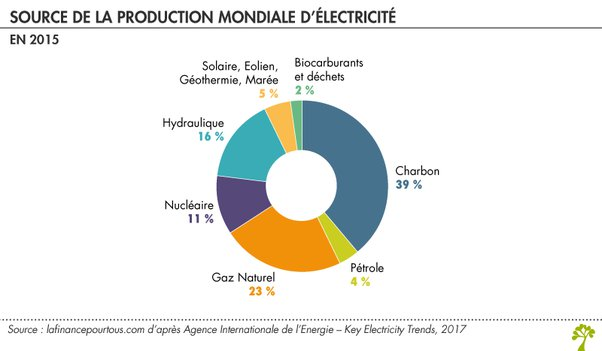

*Réponse publiée [sur Quora](https://fr.quora.com/Pourquoi-est-ce-que-le-nucl%C3%A9aire-est-la-mani%C3%A8re-la-plus-r%C3%A9pandue-de-cr%C3%A9er-de-l-%C3%A9lectricit%C3%A9/answer/Dr-Goulu)*

Il ne l'est pas.

