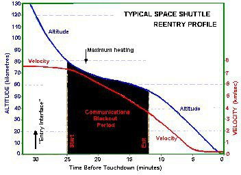

*Réponse publiée [sur Quora](https://fr.quora.com/Pourrait-on-effectuer-une-rentr%C3%A9e-dans-l-atmosph%C3%A8re-depuis-l-espace-en-%C3%A9quipant-un-module-d-une-grosse-poche-d-h%C3%A9lium-%C3%A0-la-fa%C3%A7on-d-un-ballon-sonde/answer/Dr-Goulu)*

Le gros problème c'est la vitesse. La rentrée se fait à plusieurs km/s et pendant plusieurs secondes le frottement est tel que l'engin rayonne dans les ondes radio, ce qui cause un black-out radio.

Il faudrait donc un ballon sacrément résistant…

Notez que la rentrée se produit pratiquement au double de l'altitude atteinte par les ballons.
