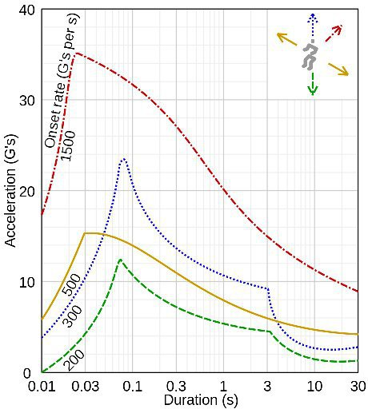

*Réponse publiée [sur Quora](https://fr.quora.com/Quelle-force-de-gravit%C3%A9-le-corps-humain-peut-endurer/answer/Dr-Goulu)*

Pour compléter l'excellente réponse d'[Evelyn](https://fr.quora.com/profile/Evelyn-90), l'article [g (accélération) — Wikipédia](w:G_(accélération)) montre cette figure

