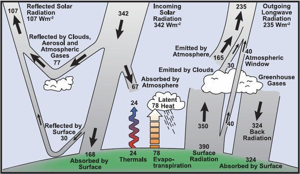

*Réponse publiée [sur Quora](https://fr.quora.com/L-apport-de-chaleur-g%C3%A9othermique-n-est-il-pas-trop-souvent-oubli%C3%A9-dans-l-analyse-des-temp%C3%A9ratures-atmosph%C3%A9riques-Au-p%C3%B4le-nord-notamment/answer/Dr-Goulu)*

Le [flux géothermique est de 0.1 W/m2](w:Géothermie) en moyenne sur la Terre, quasi constant et très faible par rapport aux 342 W/m2 reçus du Soleil et aux autres flux de chaleur dans l'atmosphère :

Je n'ai pas trouvé s'il est pris en compte dans les modèles climatiques récents (ça ne doit pas coûter très cher…)

le volcanisme a plutôt tendance à refroidir le climat via l'émission de SO2 et de poussières.
