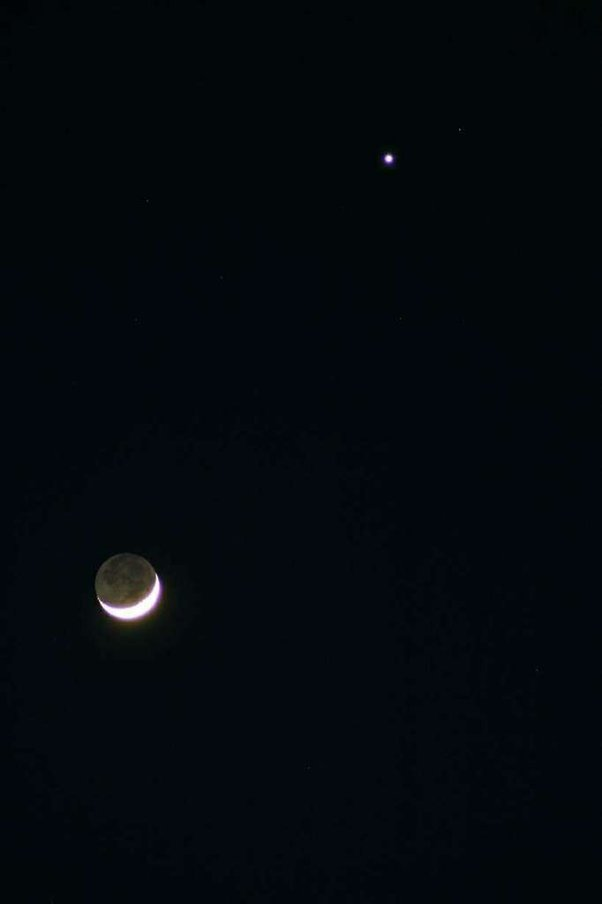

*Réponse publiée [sur Quora](https://fr.quora.com/Pourquoi-les-plan%C3%A8tes-brillent-elles-plus-que-la-lune/answer/Dr-Goulu)*

Ce n'est pas le cas.

La [Magnitude apparente](w:) de la pleine Lune est de -12.6 et Vénus au maximum de -4.6, soit 1525 fois moins brillante.

Comme la pupille de vos yeux se dilate pour s'habituer aux faibles luminosités, vous êtes plus sensible au contraste d'un petit objet peu lumineux.

Mais si vous regardez une conjonction Venus-Lune (de loin pas pleine), y'a pas photo:

