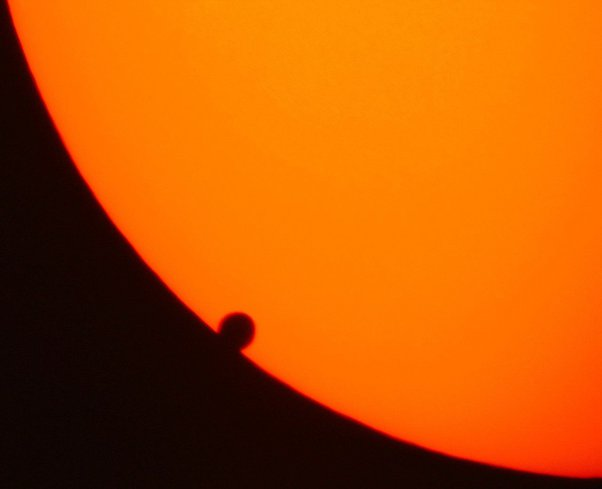

*Réponse publiée [sur Quora](https://fr.quora.com/Apr%C3%A8s-avoir-d%C3%A9couvert-une-infinit%C3%A9-dexoplan%C3%A8tes-pouvons-nous-dans-un-futur-proche-d%C3%A9velopper-des-technologies-plus-sophistiqu%C3%A9es-pour-mieux-les-observer-et-les-%C3%A9tudier/answer/Dr-Goulu)*

[On en est à 4187 exoplanètes confirmées](https://www.astrocaw.eu/ephemerides/compteur-dexoplanetes/), donc assez loin d'une infinité, mais oui, on développe activement des instruments capables notamment d'analyser les [Atmosphères extraterrestres](w:), notamment par la modification du spectre de leur étoile lorsqu'elle transite devant.

pour fixer les idées, voici une image du transit de Vénus devant le Soleil:

Le jeu consiste à obtenir les raies d'absorption spectrales dues au petit flou autour de Vénus… On sait le faire[[1]](#gmGkU) et on commence à pouvoir le faire à l'échelle d'une étoile distante. (C'est là que vous pouvez dire "WOW!").

Dans les prochaines décennies, [l'observation directe d'exoplanètes](w:Méthodes_de_détection_des_exoplanètes) avec des télescopes interférométriques spatiaux devrait permettre de distinguer des continents et des nuages de planètes pas trop éloignées.

Notes de bas de page

[[1]](#cite-gmGkU)[Observer Vénus comme.. une exoplanète!](https://www.sciencesetavenir.fr/espace/observer-venus-comme-une-exoplanete_33536)
