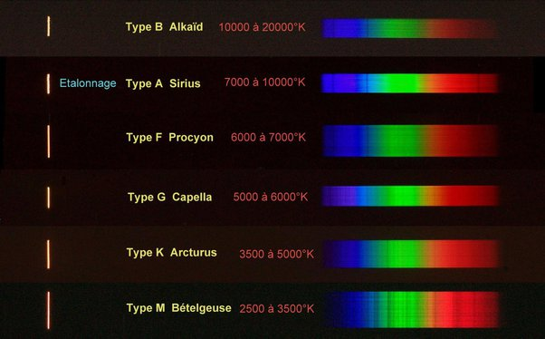

*Réponse publiée [sur Quora](https://fr.quora.com/Comment-peut-on-conna%C3%AEtre-la-composition-des-%C3%A9toiles/answer/Dr-Goulu)*

Par [Spectroscopie](w:Spectroscopie_astronomique) : la lumière émise par les étoiles comporte des [Raies](w:Raie_spectrale)spectrales spécifiques aux atomes chauds.

