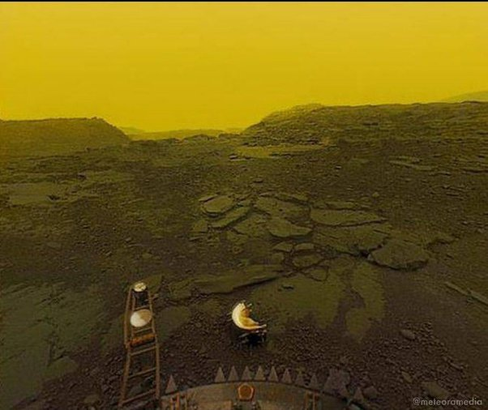

*Réponse publiée [sur Quora](https://fr.quora.com/Quels-dommages-un-aller-retour-sur-V%C3%A9nus-causerait-il-%C3%A0-un-%C3%AAtre-humain-en-termes-de-radiations-et-autres-effets-secondaires-Un-aller-retour-vers-V%C3%A9nus-serait-il-m%C3%AAme-possible/answer/Dr-Goulu)*

Les effets secondaires sont la cuisson, l'écrasement et la dissolution dans l'acide.

Quelques sondes du [Programme Vénéra](w:Programme_Venera) ont survécu une heure, voire deux (record…) lors de l'[Exploration de Vénus](w:), après une heure de descente dans une atmosphère tellement dense qu'il n'y a pas besoin de parachute pour avénusir en douceur…

La meilleure photo de la surface de Vénus est celle-ci :

Il faisait 462 degrés centigrade, la pression du CO2 ambiant était de 92 atmosphères et l'acide sulfurique qui donne cette jolie couleur jaune ne tombait juste pas en pluie pendant cette "éclaircie" .

Redécoller de cet enfer est totalement en dehors de nos capacités.

Bref, à moins que vous ne soyez en faveur d'une peine de mort particulièrement coûteuse, il n'y a strictement aucune raison d'envoyer un humain sur Vénus.
