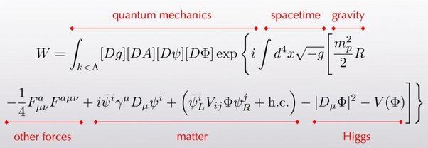
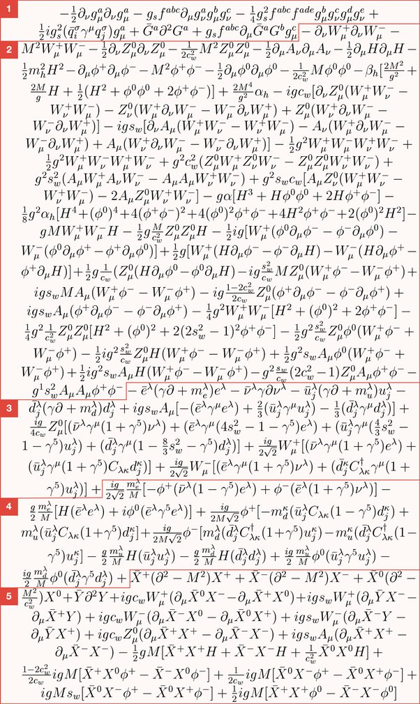

*Réponse publiée [sur Quora](https://fr.quora.com/Quelle-est-la-formule-math%C3%A9matique-de-lunivers/answer/Dr-Goulu)*

Il y en a des approchées qui sont sympa comme

trouvée sur le blog de [Sean Carroll](w:) (pas n'importe qui…) avec explications ici : [The World of Everyday Experience, In One Equation](http://www.preposterousuniverse.com/blog/2013/01/04/the-world-of-everyday-experience-in-one-equation/)

Une autre nettement plus gratinée (où je ne vois même pas de signe = …) :

de [Thomas D. Gutierrez](https://www.quora.com/profile/Thomas-D-Gutierrez) expliquée ici : [This is the Closest Thing We Have to a Master Equation of the Universe](https://futurism.com/this-is-the-closest-thing-we-have-to-a-master-equation-of-the-universe)

Quand on voit ça, on se demande si les maths sont réellement le bon langage pour décrire l'Univers … mais on a pas mieux pour l'instant …
