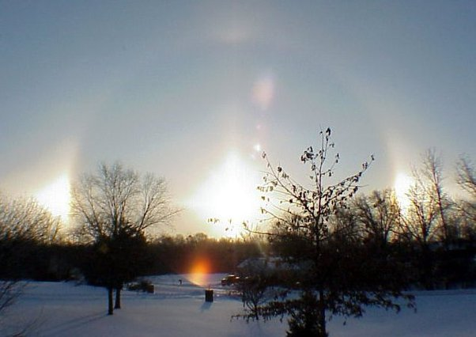

*Réponse publiée [sur Quora](https://fr.quora.com/Peut-on-voir-un-arc-en-ciel-quand-il-neige/answer/Dr-Goulu)*

en principe pas. L'arc en ciel se forme par réfraction et réflexion dans les gouttes d'eau. La neige diffuse la lumière (ce qui fait qu'elle est blanche), donc non.

Par contre avec des cristaux de glace on peut observer des [Halos](w:Halo_(phénomène_optique)) ou des [Parhélies](w:Parhélie) encore plus surprenants

