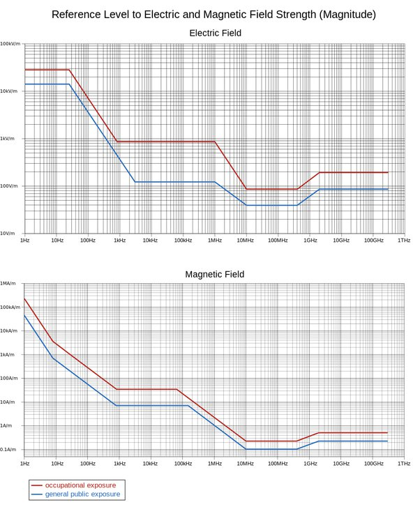

*Réponse publiée [sur Quora](https://fr.quora.com/Dans-quel-mesure-est-ce-que-lesprit-humain-est-affect%C3%A9-par-la-r%C3%A9sonance-de-Schuman-Est-ce-quelle-devrait-%C3%AAtre-r%C3%A9pliqu%C3%A9-pour-assurer-une-sant%C3%A9-mentale-ad%C3%A9quate-pour-des-voyageurs-de/answer/Dr-Goulu)*

[https://www.youtube.com/watch?v=...](https://www.youtube.com/watch?v=sYU_eDMr4xE)

[L](w:Chronologie_du_futur_lointain)es [Résonances de Schumann](w:) (au pluriel, et avec deux N, je vous ai déjà dit) sont liées à la propagation des ondes électromagnétiques dans l'atmosphère, donc il n'y en a pas dans l'espace.

Je ne sais pas ce que c'est que l'esprit humain, mais je sais qu'aucune expérience n'a jamais montré que quelqu'un soit "affecté" par une exposition inférieure aux normes de l'[ICNIRP](w:en:International_Commission_on_Non-Ionizing_Radiation_Protection) dont vous voyez sur le graphique ci-dessous qu'elles sont extrêmement élevées aux quelques Hz des [Résonances de Schumann](w:) (au pluriel, et avec deux N … )

