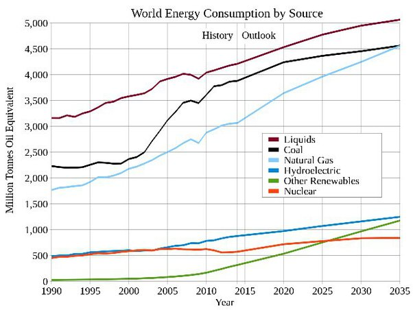

*Réponse publiée [sur Quora](https://fr.quora.com/Est-ce-que-les-panneaux-photovolta%C3%AFques-contribuent-vraiment-%C3%A0-une-baisse-de-la-consommation-d-%C3%A9nergie/answer/Dr-Goulu)*

Ils produisent de l'énergie en plus, donc personne ne s'attend à ce qu'ils contribuent à une baisse.

Dans le meilleur des cas ils remplaceront un jour des sources d'énergie plus polluantes. Ça arrivera peut-être quand le kWh sera meilleur marché que celui du charbon, sans subventions…

Pour l'instant, le solaire et l'éolien contribuent à la hausse de consommation d'énergie mondiale :

(Source [Ressources et consommation énergétiques mondiales — Wikipédia](w:Ressources_et_consommation_énergétiques_mondiales))

En 2025 ils produiront autant que le nucléaire, en 2035 autant que l'hydroélectrique, et peut-être autant que les énergies polluantes vers la fin du siècle.
