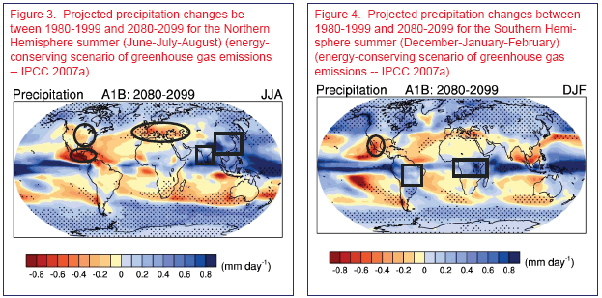

*Réponse publiée [sur Quora](https://fr.quora.com/Pourquoi-est-ce-quil-y-a-de-plus-en-plus-de-s%C3%A9cheresses-li%C3%A9es-au-r%C3%A9chauffement-climatique-alors-qu%C3%A0-cause-de-celui-ci-il-pleut-de-plus-en-plus-ce-qui-donc-humidifie-plus-la-terre/answer/Dr-Goulu)*

En raison du réchauffement, les précipitations varient (statistiquement) de manière différentes selon les endroits et la période de l'année.

Il y a des régions (comme le Mexique dans la carte ci-dessous) qui auront moins de pluie toute l'année, d'autres (régions polaires, Pérou, Afrique centrale, Indonésie) qui en auront plusss toute l'année, et d'autres plus à certaines périodes et moins à d'autres (nord des USA, Inde, Est de Australie)

( source : [Global warming - impact of climate change on global agriculture](https://www.extension.iastate.edu/agdm/articles/others/TakOct08.html) )

On ne peut pas attribuer une sécheresse ou une inondation particulière au réchauffement, seulement leur augmentation statistique sur une longue durée.

Mais maintenant qu'on sait à quoi s'attendre, on peut se préparer
