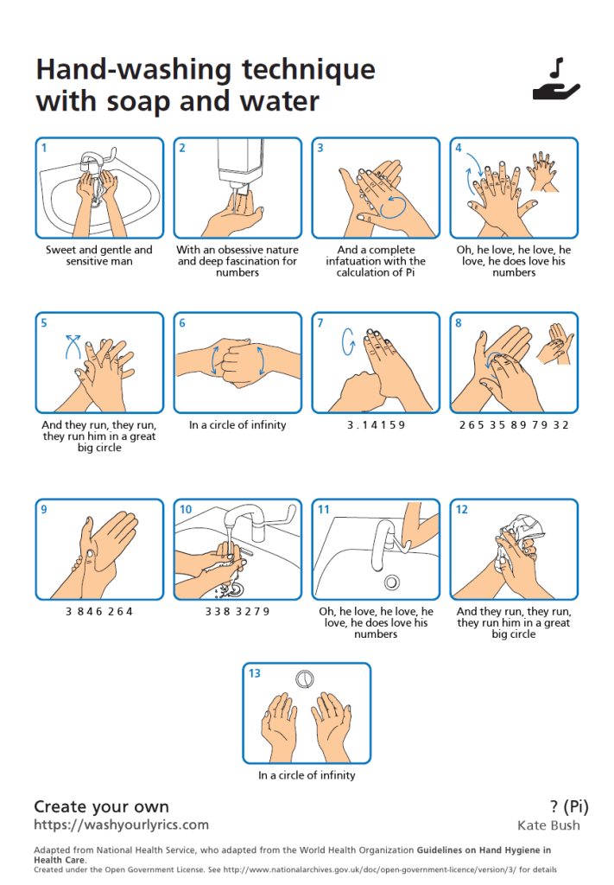

Le temps n'est pas à la fête. D'ailleurs [je ne fête plus pi le 3.14 mais tau le 6. 28](/2016/03/14/adieu-3-14-16-le-26-juin-ce-sera-tau-day/) , et je viens de trouver une excellente raison de plus pour ça : pi est encore plus faux lorsqu'il est chanté par Kate Bush :

<figure>



<figcaption>

  

</figcaption>

</figure>

C'est connu depuis 2005 \[1\] et même référencé dans ma chère [OEIS sous A112602](https://oeis.org/A112602) : à la 54ème décimale Kate chante "threeeeee oneeeee" au lieu de "zeeeeeeerooo" . Ensuite elle se rattrape pour 24 décimales, puis c'est l'enfer : elle en oublie carrément 22 en récitant correctement les 37 suivants ...

Donc désolé, mais la meilleure utilisation que je trouve de cette chanson est [https://washyourlyrics.com/](https://washyourlyrics.com/) :

#### Référence:

1. [Kate Bush sings Pi (incorrectly) sur confusability (2005)](https://usability.typepad.com/confusability/2005/11/kate_bush_sings.html)
