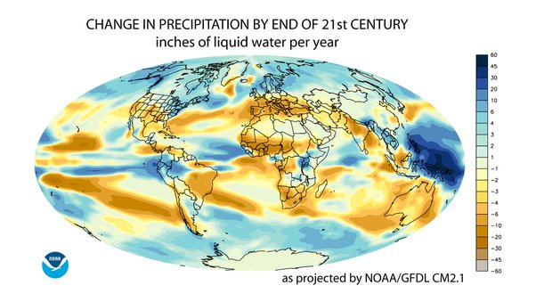

*Réponse publiée [sur Quora](https://fr.quora.com/Les-programmes-de-mod%C3%A9lisation-m%C3%A9t%C3%A9o-int%C3%A8grent-ils-les-variations-deffet-de-serre-li%C3%A9s-%C3%A0-la-vapeur-deau/answer/Dr-Goulu)*

Vous parlez de météo ou de climat ? Mais dans les deux cas la réponse est oui

La météo concerne les prévisions à court terme (quelques jours) et utilise évidemment des mesures de l'humidité de l'atmosphère prises par des stations au sol, des ballons sonde, des [Radars météorologiques](w:Radar_météorologique) et même des satellites comme [SMOS.](w:Soil_Moisture_and_Ocean_Salinity_satellite) Les modèles doivent intégrer l'effet de serre au niveau local pour pouvoir prévoir les températures. Vous avez déjà remarqué comme les écarts des températures max/min quotidiennes dépendent des nuages, donc de l'humidité en altitude ?

Les modèles climatiques utilisés pour les prévisions à long terme (quelques décennies) font la même chose mais avec un "maillage" beaucoup plus grossier et faisant des moyennes sur de plus longues périodes (mois). C'est ainsi qu'on peut par exemple prévoir qu'il va pleuvoir moins dans certaines régions du monde, et plus dans d'autres.

source : [https://www.gfdl.noaa.gov/wp-con...](https://www.gfdl.noaa.gov/wp-content/uploads/files/user_files/kd/pdf/gfdlhighlight_vol1n5.pdf)

d’après Held and Soden, (2006): [Robust responses of the hydrological cycle to global warming,](https://journals.ametsoc.org/doi/full/10.1175/JCLI3990.1) Journal of Climate, Vo. 19, No. 21, pages 5686-5699
