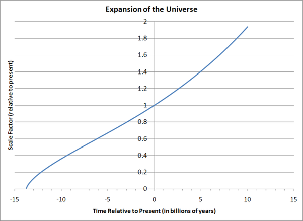

*Réponse publiée [sur Quora](https://fr.quora.com/Quelle-%C3%A9tait-la-taille-de-lUnivers-1-seconde-apr%C3%A8s-le-Big-Bang-Existe-il-une-fonction-qui-lie-le-temps-depuis-le-Big-Bang-%C3%A0-la-taille-de-lUnivers/answer/Dr-Goulu)*

Oui, ça s'appelle les [Équations de Friedmann-Lemaître](w:Équations_de_Friedmann), qui débouchent sur la [Métrique de Friedmann-Lemaître-Robertson-Walker](w:).

Mais ce sont des équations différentielles qu'il faut intégrer pour obtenir votre "fonction qui lie le temps depuis le Big Bang à la taille de l'Univers", et pour l'intégrer il faut tenir compte de la variation de "composition" de l'Univers au cours du temps.

Or il s'est passé beaucoup de choses qu'on connaît assez mal pendant la première seconde, notamment un truc qui ressemble à une [Inflation cosmique](w:).

Donc on ne sait pas très bien intégrer les équation de Friedman pendant la première seconde à ma connaissance. Mais après, on sait assez bien le faire et je viens même de trouver un code python qui le fait sur [Numerically modeling the expansion of the universe](https://reedbeta.wordpress.com/2011/08/03/numerically-modeling-the-expansion-of-the-universe/) et qui donne ça :

