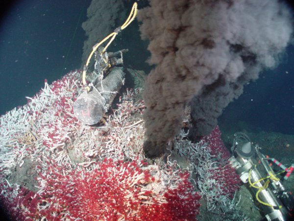

*Réponse publiée [sur Quora](https://fr.quora.com/Pourquoi-la-lave-existe-si-la-vie-d%C3%A9pend-de-leau-Comment-leau-et-la-lave-peuvent-cohabiter/answer/Dr-Goulu)*

Comme ça:

(source : [La biodiversité en milieu extrême](http://edu.mnhn.fr/mod/page/view.php?id=1480))

Ceci est un [Mont hydrothermal](w:), plus précisément un "fumeur noir". Des gaz d'origine volcanique chauffent l'eau à plus de 100°C, mais elle reste liquide grâce à la pression due à la profondeur. Toutes sortes de forme de vie arrivent à utiliser l'énergie chimique apportée par ces matériaux, sans accès à la lumière du jour.

La lave n'a recouvert toute la Terre que dans les premières dizaines de millions d'années, avant la formation de la croûte. Les océans se sont formés assez vite :

> 150 millions d'années après sa formation, notre Terre avait donc des océans riches en fer (de couleur verte) et son atmosphère plus dense que l'actuelle lui donnait une teinte rougeâtre. La température à la surface était certainement de l'ordre de 93°C.
> ([Les étapes de la formation de la Terre](http://acces.ens-lyon.fr/acces/thematiques/limites/Temps/allee/comprendre/les-etapes-de-la-formation-de-la-terre) ENS-LYON)
