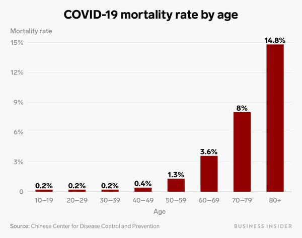

*Réponse publiée [sur Quora](https://fr.quora.com/Quelles-sont-les-chance-qu-un-adolescent-meurt-du-covid-19/answer/Dr-Goulu)*

C'est plutôt une poisse qu'une chance, je dirais (ou alors vous aimeriez déjà vous débarrasser de votre ado après seulement 2 semaines ?) mais d'après les chiffres chinois, c'est autour de 2 morts pour 1000 adolescents :

