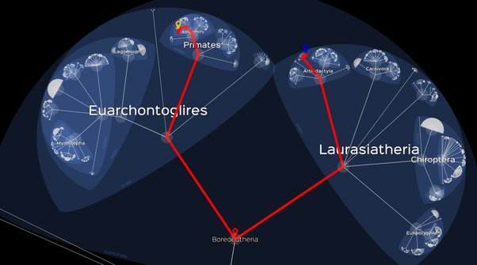

*Réponse publiée [sur Quora](https://fr.quora.com/Avons-nous-un-anc%C3%AAtre-commun-avec-le-cochon/answer/Dr-Goulu)*

Bien sur. Il y a un toujours ancêtre commun entre n'importe quelle paire d'espèces.

Entre Homo Sapiens et Sus Scrofa Scrofa , [Lifemap](http://lifemap.univ-lyon1.fr/explore.html) dit que c'est un [Boreoeutheria](w:en:Boreoeutheria) qui vivait il y a 100 à 80 millions d'années, ou 65 selon d'autres estimations.

