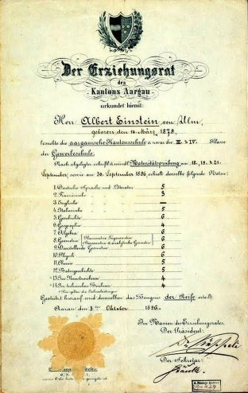

*Réponse publiée [sur Quora](https://fr.quora.com/Combien-de-fois-Albert-Einstein-a-%C3%A9chou%C3%A9-au-bac/answer/Dr-Goulu)*

Zero. Voici ses résultats au bac ("Maturitätsprüfung" est souligné)

6 est la note maximale en Suisse, il l'a obtenue dans toutes les branches scientifiques sauf en chimie (5) et en biologie (5). Il a obtenu la note suffisante (4) dans toutes les autres branches sauf le français (3).
