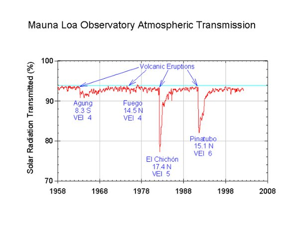

*Réponse publiée [sur Quora](https://fr.quora.com/Quels-sont-les-volcans-dont-l-%C3%A9ruption-prochaine-pourrait-baisser-temporairement-la-temp%C3%A9rature-de-la-terre-de-1C/answer/Dr-Goulu)*

Il y en a beaucoup. Rien qu'au siècle passé il y a eu plusieurs petits [Hiver volcanique](w:) qui ont duré quelques mois. Les éruptions du El Chichon et du Pinatubo ont réduit la transparence de l'atmosphère de près de 10% à Hawaï :

Mais si vous espérez combattre le réchauffement climatique comme ça, ce sera délicat à doser... Une [Année sans été](w:) comme en 1816 a provoqué d'énormes famines
