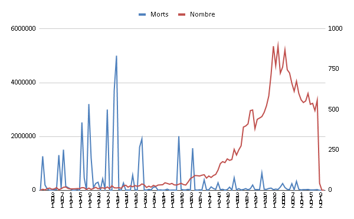

*Réponse publiée [sur Quora](https://fr.quora.com/Depuis-le-d%C3%A9but-de-l-ann%C3%A9e-2020-le-chiffre-des-catastrophes-naturelles-n-est-il-pas-le-plus-%C3%A9lev%C3%A9-du-si%C3%A8cle/answer/Dr-Goulu)*

Le [Centre for Research on the Epidemiology of Disasters](https://www.cred.be/) maintient la[international disasters database](https://www.emdat.be/) . Je me suis inscrit, ai mis [la base de données des catastrophes naturelles de 1900 à nos jours là](https://docs.google.com/spreadsheets/d/12AW_Qui88TkHacgmX0uxsPbbwKRPro6jtlP8axTcOis/edit?usp=sharing), et fait le petit graphique ci-dessous :

On voit qu'il y a beaucoup plus de catastrophes répertoriées depuis les années 1980, probablement par l'amélioration des moyens de communication, et dans le même temps beaucoup moins de morts "en moyenne", peut être par l'amélioration de la prévention et des secours. Je n'ai pas d'explication pour la baisse assez nette du nombre de catastrophes depuis 2000.

Le CRED a recensé 632 catastrophes naturelles en 2019. En 2020 on est à 104 pour les 3 premiers mois de l'année, donc en dessous de l'année passée pour l'instant.

Donc non.
